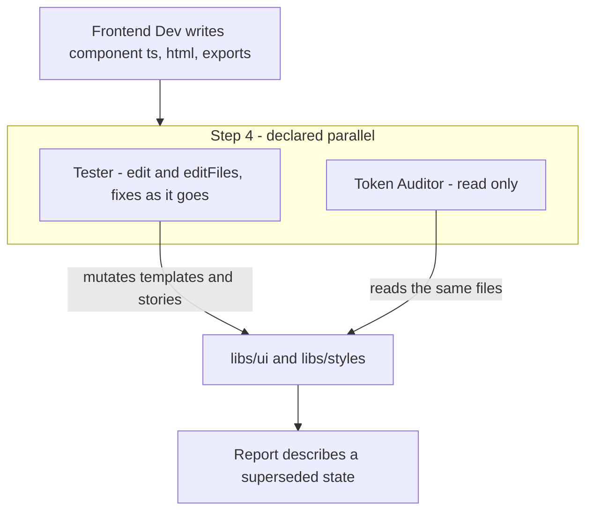

# Harden the Plectrum agent workflow

The seven definitions in [agents/](agents/) are a sound role taxonomy with a real bug in how they run concurrently. This plan keeps all seven roles and fixes the mechanics underneath them.

Scope note: this repo has no `libs/`, `contracts/` or `.ai/`, so these files are copies of work that executes in the Solidaris Angular repo. Every change lands in the seven markdown files plus one new spec document; nothing here is runnable or testable locally.

## The concurrency bug

[agents/tester.agent.md](agents/tester.agent.md) grants `edit` and `editFiles` (lines 8-9) and instructs "You fix issues you find — you do not just report them" (line 15). It runs in parallel with the read-only Token Auditor in Step 4 ([agents/solidaris.agent.md:91](agents/solidaris.agent.md)) and with both Architect and Token Auditor in the Review workflow (line 121).

It also contradicts its sibling: [agents/token-auditor.agent.md:14](agents/token-auditor.agent.md) says "you fix them only when explicitly asked." Two agents in the same parallel step hold opposite stances on mutation.

**Fix.** Make Tester read-only inside parallel audit steps and add a serialized Step 4b for remediation, after both reports are in. This is the _parallelise readers, serialise writers_ rule applied to the one place the current design violates it.

## Ownership and ordering

Three concrete collisions, all fixable in the markdown:

- **Stories get clobbered.** UX Engineer writes `libs/ui/src/lib/{name}/{name}.stories.ts` in its Step 4 ([agents/ux-engineer.agent.md:88](agents/ux-engineer.agent.md)). Frontend Dev then runs the `npm run PDS:component` scaffold into that same folder in its Step 2 ([agents/frontend-dev.agent.md:43](agents/frontend-dev.agent.md)). The generator runs after the file it may overwrite. Move the scaffold to a pre-step before UX Engineer, or have Frontend Dev scaffold into an empty folder and never regenerate.
- **`styleUrl` contradicts the architecture.** The component template carries `styleUrl: './{name}.component.scss'` ([agents/frontend-dev.agent.md:55](agents/frontend-dev.agent.md)) while line 20 of the same file says styles live in the global ITCSS sheet. That colocated stylesheet is exactly the "style duplicated between `libs/styles` and an app's local stylesheet" violation the Architect is told to flag ([agents/architect.agent.md:46](agents/architect.agent.md)). Drop the `styleUrl` line.
- **No ownership map exists.** Nothing declares which agent owns which paths, which is the actual mechanism that prevents write conflicts. Add a table to the coordinator and a matching "you own / you never touch" line in each specialist.

## Handoffs are prose, not contracts

UX Researcher produces a durable artefact at `.ai/briefs/{component-name}.brief.md` ([agents/ux-researcher.agent.md:49](agents/ux-researcher.agent.md)), and UX Engineer loads it from disk ([agents/ux-engineer.agent.md:30](agents/ux-engineer.agent.md)). Architect produces nothing durable — it has no output section at all — so its guidance exists only as `[paste Architect output]` re-serialized through the coordinator's context ([agents/solidaris.agent.md:69](agents/solidaris.agent.md)). That is the lossy hop, and it is the one carrying the structural decisions.

Three changes:

- Give Architect a file output at `.ai/decisions/{component}.arch.md` with the ITCSS layer, the SSOT verdict and any duplicate found.
- Add `status: complete | partial | blocked` front matter to the brief template so UX Engineer can tell a finished brief from one where the Figma MCP failed halfway. Its only current failure path is "if no brief exists" (line 31).
- Pass paths, not pasted prose, and add an explicit gate after Step 1: if Architect reports a duplicate in `contracts/index.json`, Step 2 aborts and escalates rather than building a second copy.

## A deterministic pre-flight for the Token Auditor

Four of the five audit checks are mechanical: prefix compliance ([agents/token-auditor.agent.md:24](agents/token-auditor.agent.md)) is a regex, ITCSS file naming (line 46) is a glob plus a regex, semantic coverage (line 34) is a declared-versus-used diff, and PrimeNG sync (line 40) is a grep for hardcoded values inside `--p-*` overrides. Only Figma drift (line 56) needs judgement.

The role stays. What changes is that it stops performing those four by hand and instead runs a pre-flight and interprets the result — faster, reproducible, and able to run in CI on every commit rather than only when someone invokes the coordinator. Write the spec as `agents/checks.spec.md` covering:

- stylelint rules for the `#{$pds-prefix}` interpolation requirement and the missing `@use 'settings.prefix' as *` case
- a filename rule for `_{layer-folder}.{description}.scss`
- a node script diffing declared `--pds-*` tokens against those used in `06-components/`, reporting primitives referenced directly
- a grep pass for literal values inside `--p-*` overrides

Precise enough to drop into the Solidaris repo, with the exit-code contract the agent reads.

## Tool grants and duplicates

- The coordinator holds `edit`, `editFiles` and `runCommands` ([agents/solidaris.agent.md:8](agents/solidaris.agent.md)) while its own rule says "Never implement code yourself" (line 140). Drop the grants and the constraint becomes structural rather than advisory.
- UX Engineer holds `figma/*` (line 11) although its input is the brief and Figma extraction belongs to the Researcher. Overlapping grants invite duplicated work and a second source of truth.
- `npm run generate-index` runs twice: once in Frontend Dev's Step 5 ([agents/frontend-dev.agent.md:85](agents/frontend-dev.agent.md)) and again via the coordinator's closing rule ([agents/solidaris.agent.md:144](agents/solidaris.agent.md)), which also fires on the Review workflow where nothing was generated. Keep it in Frontend Dev only.
- Soften "VS Code will execute them concurrently" (line 29) to an instruction about invocation order rather than a claim about the host. If the runtime does not parallelise, the current wording means the design silently degrades to sequential with nothing to signal it.
