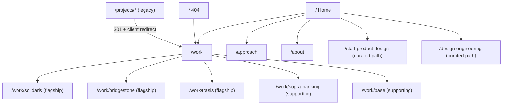

# Portfolio Transformation Redesign

Source of truth: [portfolio-transformation-brief-for-cursor.md](portfolio-transformation-brief-for-cursor.md). Decisions confirmed: discipline descriptor "Staff Product Design · Design Systems · UX Engineering"; full 5-phase scope. Stack stays React 18 + Vite + Tailwind/SCSS + framer-motion (no new runtime deps).

## Ground rules carried through every task

- Never invent facts. Unverifiable metrics (60%, 85%, 3x, 40%, 30%, 50%) are kept only with a "reported" qualifier plus an evidence note, or replaced with qualitative statements. All gaps go into a new `CONTENT_CHECKLIST.md` (brief section 21) — no raw `[EVIDENCE NEEDED]` text rendered on the public site.
- One identity, one set of facts; role paths only re-order and re-emphasise.
- Every visual gets a delivery-state label: Shipped / Validated prototype / Concept / Ongoing.

## New information architecture

Nav becomes: Work · Approach · About · CV · Contact ([src/ui/components/navigation/Navigation.tsx](src/ui/components/navigation/Navigation.tsx)), plus a skip link.

## 1. Content layer and evidence components

- New `src/content/` typed data: `site.ts` (positioning, hero copy, proof bar, capabilities, compact career progression, contact) and `caseStudies/` (one file per case with the new schema below). Listings, featured cards, and role paths all read from these objects so facts exist once.
- New `src/ui/components/evidence/` per brief section 13: `OutcomeMetric` (value, label, evidence note, confidence), `OwnershipBadge` (Led/Designed/Implemented/Documented/Tested/Influenced/Team outcome), `DeliveryStateTag`, `ArtefactFigure` (image + structured caption: what/why/contribution/state), `DecisionBlock` (tension, alternatives, evidence, decision, trade-off, result), `RecruiterSummary`.
- Create `CONTENT_CHECKLIST.md` listing every missing asset/evidence item from brief section 21 (metric baselines, anonymised Solidaris screenshots, Storybook/token captures, portrait, role-specific CVs, logo permissions).

## 2. Routing, redirects, 404

- [src/App.tsx](src/App.tsx): new routes (`/work`, five `/work/:slug` pages, `/approach`, `/about`, `/staff-product-design`, `/design-engineering`, `*` 404), `React.lazy` + Suspense for all non-home routes, `<Navigate>` redirects from `/projects/*`.
- [public/\_redirects](public/_redirects): `/projects/* /work/:splat 301!` before the SPA fallback (note: `/projects/sopra` maps to `/work/sopra-banking`).

## 3. Homepage rebuild (brief section 6)

Rebuild [src/pages/Home.tsx](src/pages/Home.tsx) with new section components:

1. Hero: eyebrow "Staff Product Design · Design Systems · UX Engineering"; H1 "I design the systems behind complex products—and help teams ship them."; supporting line; CTAs "View selected work" + "Download CV"; context link "Currently modernising Solidaris's internal product ecosystem." Hero visual = assembled proof composition from real assets (Bridgestone UI screenshots + Solidaris ecosystem/Plectrum diagram), not the abstract gradient alone.
2. Proof bar: "15 years across product design and front-end UI" (verifiable from career data, 2010 start), "40+ reusable components delivered (reported)", "Figma, Storybook, Angular and TypeScript", "Complex B2B healthcare, mobility and banking products".
   3-5. Three featured cards (Solidaris, Bridgestone, Trasis): problem line, role, capability tags, one outcome, meaningful preview, project-specific CTA text ("Read the Solidaris ecosystem case study" — fixes the repeated "See this Case Study" accessibility issue in [src/ui/components/projects/Projects.tsx](src/ui/components/projects/Projects.tsx)).
3. "How I create leverage": Product direction / Systems / Delivery, each linking into case sections.
4. Compact artefact gallery using `ArtefactFigure` (tokens, component contracts, iCRM inbox model, workflow journeys — from existing `public/screenshots/`).
5. Compact career progression (5 rows, one scope line + two contributions + case link) replacing the long narrative in [src/ui/components/career/Career.tsx](src/ui/components/career/Career.tsx).
   9-10. About/working-style teaser + contact/CV footer. Single CV (`public/cv/DBG_CV_2025.pdf`) for now; dual role-specific CV slots wired but hidden until files exist (checklist item — brief forbids generating CVs here).

## 4. Case-study template (brief section 7)

New `src/pages/CaseStudyTemplate.tsx` (evolves [src/pages/ProjectTemplate.tsx](src/pages/ProjectTemplate.tsx), keeps TOC + `ProjectGallery` lightbox): case hero (outcome title, one-line summary, role, period, team model, stack, confidentiality note, strong visual) → RecruiterSummary → strategic framing → scope and ownership map → 3-5 DecisionBlocks → product craft at readable scale (no tiny device frames) → system/engineering evidence → validation and iteration → outcomes split into User/Business/System/Learning with evidence notes → reflection.

## 5. Flagship case rewrites

- Solidaris → "Solidaris: Creating a Coherent UX Across a Complex Healthcare Application Ecosystem" (merges the current page with [solidaris-portfolio-use-case-reference.md](solidaris-portfolio-use-case-reference.md); ecosystem narrative first, Plectrum/AI-ready system as engineering evidence; everything labeled Ongoing/Validated prototype/Concept correctly).
- Bridgestone → "Building a Design System and Front-End UI Foundation for a Fleet Management Platform"; surface 40+ components, Storybook, tokens, ITCSS/BEM, PR review, coaching immediately; 60% figure kept only with evidence note.
- Trasis → "Trasis QC1: Designing a Safety-Critical Interface for Radiopharmaceutical Quality Control"; qualify 85% / 3x claims; sober safety wording.
- Copy rules from brief section 14 applied throughout (ownership verbs, no "passionate/seamless/spoiler alert" voice).

## 6. Supporting cases

Sopra Banking → "Modernising CSS Architecture and Design Workflows for Enterprise Banking Software"; Base → "Building Front-End Foundations for High-Traffic Telecom Experiences". Both shorter, visually secondary, listed under "Earlier foundations" on `/work`.

## 7. Approach and About pages

- `/approach`: the three capabilities expanded with linked case evidence, decision-making style, quality standards, design-to-code workflow.
- `/about` (brief section 15): current focus, progression from front-end UI to product/systems, how the two backgrounds reinforce each other, working style, "Morlanwelz, Belgium · Europe/Brussels", short personal note, CV/contact.

## 8. Role-specific paths

`/staff-product-design` (order: Solidaris, Trasis, Bridgestone; strategy/ambiguity/testing emphasis) and `/design-engineering` (order: Bridgestone, Solidaris/Plectrum, Trasis/Sopra; tokens/Storybook/architecture emphasis). Lightweight curated landings reusing content data, each with role-specific SEO meta and its own CV label.

## 9. Visual refresh (brief section 12)

- Purple becomes a controlled accent: `Background` WebGL gradient stays subtle on the home hero, neutral dark surfaces on case/content pages; fewer glass/rounded containers; consistent card ratios.
- Deliberate type scale and spacing rhythm in [tailwind.config.js](tailwind.config.js); constrained line lengths; visible focus states in the SCSS component layer.
- Screenshots/diagrams become the visual centre at readable scale.

## 10. Quality pass (a11y, SEO, analytics, performance)

- Accessibility: skip link + `main` landmark, project-specific accessible names everywhere, `prefers-reduced-motion` gating for `PageTransition`/bounce/TOC motion, heading-order and alt-text audit, WCAG AA contrast check.
- SEO: new `useSeo()` hook for per-route title/description/canonical/OG; create the missing `public/og-image` asset; move `robots.txt` and `sitemap.xml` from repo root into `public/` (currently not deployed — bug); regenerate sitemap for all routes; update [index.html](index.html) defaults + JSON-LD to the new positioning.
- Analytics: wire existing `trackPortfolioEvent` in [src/utils/basicAnalytics.ts](src/utils/basicAnalytics.ts) for case opened, role path selected, CV downloaded, contact initiated, external links.
- Performance: lazy routes, `loading="lazy"` below the fold, remove dead components (Logo, Badge, Timeline stack, MasonryGallery, StackedImageShowcase, broken ExperienceCard).
- Verify every route (direct load + refresh + redirects) in the browser, run the production build, and sanity-check the ten-second scan against brief section 24.
