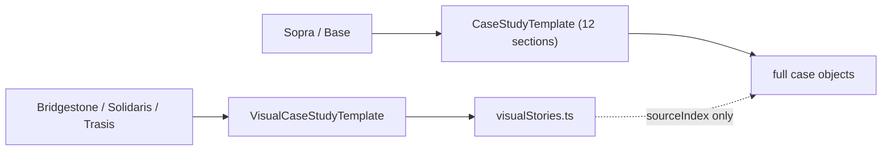
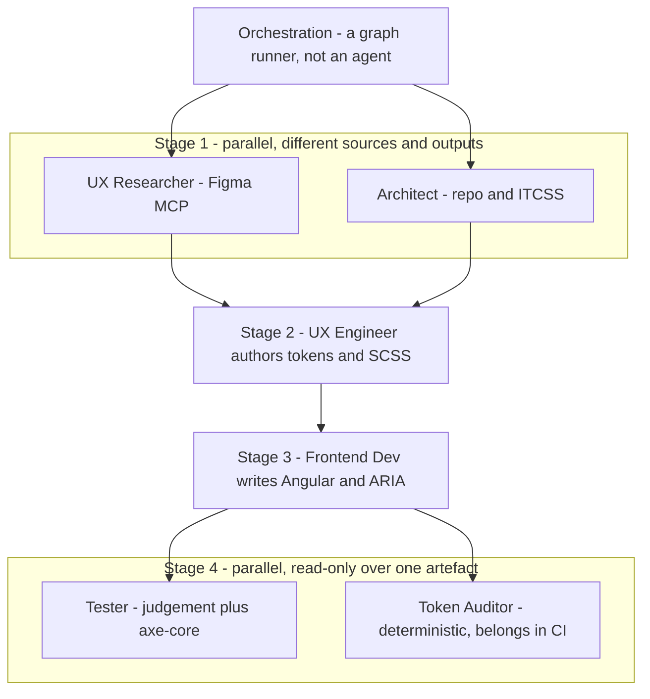

# Staff-level signal for the case studies

## The strategic call

The four sites you linked are sales collateral. Metalab and Clay are selling taste to a buyer who will never see the code, so visual-first with thin captions is exactly right for them. You are selling to a hiring committee that has to defend a Staff Design Engineer level. That reader needs something they cannot get from a screenshot: evidence of technical depth, scope and judgment.

So copy the rhythm of those pages, not the payload. You already have the rhythm — [`VisualCaseStudyTemplate.tsx`](src/pages/VisualCaseStudyTemplate.tsx) with numbered chapters, large media and decision strips is the right chassis. What is missing is that the strongest thing you own is currently a static `<pre>` block.

Your differentiator is real and rare: CSS custom properties as the authoritative source, a parseable naming grammar, a TypeScript CSSOM reader that generates Storybook foundation pages, `color-mix` shade composition, eight ITCSS layers, scroll-driven animation and style queries. Almost no product designer can show that. Right now it appears as three code samples in Bridgestone chapter 05 and nothing else.

**Make the artefact run.** Rebuild the pipeline as a live demo inside the page: real custom properties, the real regex, the real grouping, rendering the real swatch table — and let the visitor change a token and watch the generated documentation update. That converts "documentation cannot drift" from a claim into something the reader verifies in four seconds. Same move for Trasis: a toggle that proves the redundant-encoding decision under a colour-vision filter beats a paragraph describing it.

Second call: **the "clip planned" frames are a liability.** There are seven `clip-placeholder` frames, including the hero of all three flagships. The first thing a hiring manager sees on Bridgestone is a play button over the words "a short Storybook capture will show". That reads as unfinished. Every still those placeholders wrap already exists on disk — show them.

## What is actually in the repo

The old plan file describes an implementation that was never built (no `MediaFrame`, no `MediaPlaceholder`, no Notes `<details>`, no `WorkCard variant="index"`). What shipped instead:

- Bridgestone, Solidaris, Trasis render through [`VisualCaseStudyTemplate.tsx`](src/pages/VisualCaseStudyTemplate.tsx) driven by [`visualStories.ts`](src/content/caseStudies/visualStories.ts) — 5 to 6 chapters each.
- Sopra and Base still render through the old 12-section [`CaseStudyTemplate.tsx`](src/pages/CaseStudyTemplate.tsx) at roughly 1,400 to 2,000 visible words. Two layouts, one site.
- `/work` flagship cards use the default `editorial` `WorkCard`, identical to the home cards.
- The design-engineering payload in `bridgestone.ts` reaches the page only through `{ kind: 'system-evidence', sourceIndex }`. `contracts-index.svg` and `ai-agent-workflow.svg` in `solidaris.ts` are never rendered anywhere.



## Bugs to fix first

- [`PageTransition.tsx:136`](src/ui/components/page-transition/PageTransition.tsx) returns `<div className="relative">{children}</div>` under `prefers-reduced-motion`, dropping `data-route`. [`TableOfContents.tsx:37`](src/ui/components/table-of-contents/TableOfContents.tsx) scans `[data-route="${pathname}"]`, so the table of contents is empty for every reduced-motion visitor.
- [`App.tsx:184`](src/App.tsx) gates the desktop rail to `/^\/work\/(sopra-banking|base)$/`. The three chaptered flagship pages — the ones long enough to need it — have no rail at all.
- [`Card.tsx:373`](src/ui/components/cards/Card.tsx) puts `aria-disabled="true"` on a `<div>` with no role.
- [`basicAnalytics.ts:141`](src/utils/basicAnalytics.ts) logs to console on every tracked event, including case views.
- `TableOfContents.tsx:43` collects `h3[id]`, but no case-page `h3` has an id.

## Consistency with your existing components

`VisualCaseStudyTemplate` invented a second palette. Site-wide the language is `gray-*` plus `purple-*` with `amber`/`emerald`/`sky` as semantics; the visual template uses `text-white`, `border-white/10` and `bg-gray-950/*`. Concretely:

- h1 is `md:text-6xl lg:text-7xl text-white` here versus `md:text-4xl text-purple-300` on every other page.
- Chapter h2 is `text-white md:text-5xl`; `WorkIndex` section h2 is `text-xl text-gray-200`.
- Body copy uses a one-off `text-[1.02rem]`.
- `evidenceStatusStyles` uses `sky-400` where [`EvidenceClassTag.tsx:8`](src/ui/components/evidence/EvidenceClassTag.tsx) uses `sky-500`.
- The figures at lines 62, 101, 191, 212, 291 and 406 are hand-rolled panels rather than `Card` or a shared surface.
- The footer renders a second `h2` after the reflection `h2`.

Keep the editorial scale — it is what makes the page feel like the references — but express it in the existing tokens: `border-gray-700/60` instead of `border-white/10`, `text-gray-100` for chapter headings, and one shared `StoryFigure` surface used by both templates.

## Live demos: the Staff proof

Add `{ kind: 'live-demo', demoId }` to `VisualStoryMedia` in [`visualStories.ts`](src/content/caseStudies/visualStories.ts), a lazy registry in `src/ui/components/demos/`, and a shared `DemoFrame` carrying the label, a "runs in this page" note and reduced-motion handling. Each demo is a re-implementation of a technique, labelled as such — never presented as captured client software.

**Token pipeline (Bridgestone chapter 05, the centrepiece).** Scoped custom properties using the real grammar `--color--{category}--{subcategory}__{property}`, read back through `getComputedStyle`, validated with the case's own regex and grouped into the swatch table:

```ts
if (!/^--color--.+-[^-]+__.*$/.test(varName)) return;
const [path] = varName.split("__");
const [, , category, subcategory] = path.split("--");
```

Three panes — source, parser, generated output — with an editable token so the output visibly regenerates. A second tab drives a base hue through `color-mix(in srgb, ...)` so derived shades recompute, showing relationships stored rather than colours duplicated.

**Redundant encoding (Trasis chapter 04).** A QC results strip toggling colour-only against colour plus pattern, text and hierarchy, under a selectable colour-vision SVG filter. Generic components, no client assets, and it proves the safety-critical decision instead of asserting it.

**Token tiers (Solidaris chapter 05, if the first two land well).** Primitive to semantic to component resolution across the PrimeNG bridge, clicking a component part to see which tier resolves it.

All demos lazy-loaded behind `React.lazy` and keyboard operable — the demo is itself a work sample.

## The agent workflow: render the review, not just the boxes

`ai-agent-workflow.svg` reaches no page today, and shipping it unchanged is the weaker move. Seven role boxes under an orchestrator is exactly the shape a technical reader has learned to distrust, so answer their first question inside the artefact: do these actually run in parallel, and do you need seven?

Half the analysis is already in your own data. [`site.ts:93`](src/content/site.ts) carries `parallel: true` on the research and QA stages and `parallel: false` on the two middle ones, so the staged graph was deliberate and the SVG is faithful to it. Nothing on the site currently overclaims.



Two rules produce that shape. **Data dependency**: UX Engineer is a join waiting on both research roles, and Frontend Dev cannot start before tokens exist. **Write conflict**: UX Engineer and Frontend Dev both edit the same component's files, so they would clobber each other even with no data dependency between them. What falls out is _parallelise readers, serialise writers_ — the QA pair works because both read one finished artefact and write to disjoint paths, and the research pair works because one reads Figma and the other reads the repo.

The retrospective conclusion is that three of the seven boxes are not agents. Orchestration is a graph runner: with contracts fixed and the shape static, a model in that slot adds a round trip and a lossy summarisation at every hop while doing no domain work. Token Auditor is deterministic — prefix, coverage and Figma drift are a stylelint rule plus a declared-versus-used diff, which is faster, reproducible and belongs in CI on every commit. Tester splits down the middle: axe-core covers the mechanical half of WCAG AA, while writing meaningful tests is judgement and stays an agent, kept separate from Frontend Dev because a reviewer that did not write the code finds more.

**Redraw the SVG in two registers.** Solid strokes stay faithful to the proposal — the seven roles, plus stage bands, brackets over the two parallel pairs and a `critical path: 4 stages` label making the point that agent count cannot shorten it. A dashed overlay in a second colour carries the later review pass: `deterministic — belongs in CI` on Token Auditor, `mechanical half scriptable` on Tester, `a graph, not an agent` on Orchestration, with a legend separating proposal from review. Keep the existing footer line. A diagram that audits its own architecture is a stronger signal than a clean one.

**Give it its own chapter.** Chapter 05 is about the fork and the contribution path, where `token-architecture.svg` and `contracts-index.svg` pair naturally as two system-structure diagrams under the existing `layout: 'split'`. A third item flips the grid to `md:grid-cols-3` ([`VisualCaseStudyTemplate.tsx:153`](src/pages/VisualCaseStudyTemplate.tsx)) and an annotated 1280x720 schematic is unreadable at a third width. Add chapter 06 `workflow-experiment` with the diagram as the only media item so it renders `grid-cols-1`, the dependency reasoning in the paragraphs, and a `decision` strip: parallelism was constrained by shared file writes rather than role count; the choice was a staged graph with two parallel pairs; the trade-off is that a four-stage critical path caps the achievable speed-up.

**One type change.** `reflection.change` is a single `string` ([`visualStories.ts:72`](src/content/caseStudies/visualStories.ts)) and already holds the fork lesson, so widen it to `string | string[]` and have `ReflectionCard` render a list when handed an array. That matches how [`solidaris.ts:466`](src/content/caseStudies/solidaris.ts) already models `reflection.change` as an array, and it gives the retrospective a home next to the existing `learning` line about AI documentation being an output: _decide which steps are deterministic before assigning them an agent — the token audit was a lint rule, not a role._

## Content moves

- Replace the hero `clip-placeholder` on all three flagships with the real still, full bleed, no play chrome. Keep at most one clip placeholder, on the Solidaris iShare journey where motion genuinely adds information.
- Put the artefact-countable numbers where they are seen: 8 ITCSS layers, 39 story files and 51 MDX pages, 15 base hues, 2 themes. These belong in the Bridgestone hero facts strip or an evidence band, not buried in `metrics` that the visual template never renders. Counts survive scrutiny in a way percentages do not, and you have deliberately avoided invented percentages — keep it that way.
- Wire `contracts-index.svg` into the Solidaris `shared-contribution` chapter beside `token-architecture.svg`. Machine-readable component contracts are strong Staff design-engineering signal and currently render nowhere. `ai-agent-workflow.svg` gets its own chapter — see the section above.
- Port Sopra and Base to the visual template with three chapters each, then retire `CaseStudyTemplate.tsx`. A reader who clicks "Earlier foundations" should not hit a different website.
- Slim the `/work` flagship cards to thumbnail, company, short title, one-line problem, tags and a `View {Company}` CTA via a new `index` variant, leaving `FeaturedCases` on `editorial` so home is untouched.
