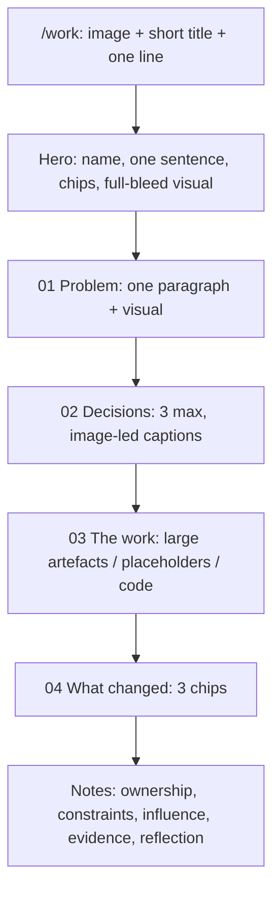

# Visual-first case studies (less text, more proof)

**Home is out of scope** — no copy, layout, gallery, or featured-card changes on `/`. Scope is [`/work`](src/pages/WorkIndex.tsx) plus the five case pages rendered by [`CaseStudyTemplate.tsx`](src/pages/CaseStudyTemplate.tsx).

The last trim only shortened paragraphs. The pages still feel long because the **template has ~12 labeled sections** (30-second summary, framing, decisions as definition lists, craft, chronology, ownership, constraints, influence, system evidence, validation, outcomes, evidence ledger, reflection). Agency case studies you linked are 4–6 chapters: a heading, one short block of text, then a large still or video.

## Placeholders now — no asset wait

Do **not** block on recordings or missing PNGs. This pass ships the visual-chapter layout with **labeled placeholder frames**. Real stills and MP4s swap in later by replacing files (same paths) or setting `videoSrc` — no second template rewrite.

**What exists today:** Solidaris product PNGs/SVGs in `public/screenshots/solidaris/`. Use those as-is.

**What is missing:** Bridgestone, Trasis, Sopra, Base screenshots and all work-index thumbnails except Solidaris; no files in `public/videos/`. For every missing still **and** every intended video slot, render a 16:9 (or natural) placeholder — dark frame, case name, intended artefact title, and a “Still” or “Video” badge. Same visual language as the existing Solidaris SVG diagrams (dark labeled frames), not broken `` 404s.

Extend [`ArtefactFigure`](src/ui/components/evidence/ArtefactFigure.tsx) (and WorkCard thumbnails) so a missing `src` or an explicit `placeholder: true` / `videoSrc` without a file shows the frame instead of a dead image. When a real file lands at the same path, the placeholder disappears.

Video behaviour (muted loop, `playsInline`, reduced-motion freeze) is **specified but not implemented until an MP4 exists**. For this pass, video slots are placeholders only.

Cursor still cannot record MP4 from the browser. Later, when you want real media:

- Bridgestone Storybook (yes) / FleetBridge app (no)
- Solidaris iShare + iGED (yes) / iCRM Figma stills only
- Trasis (no access) — stills or placeholders forever

Shot list stays in [`CONTENT_CHECKLIST.md`](CONTENT_CHECKLIST.md) as a later task, not a prerequisite.

## `/work` index: stop dumping the case onto the card

[`WorkCard`](src/ui/components/work/WorkCard.tsx) currently stacks long title + problem paragraph + role + tags + evidence paragraph + long CTA. That is why the work page feels like reading before you have opened anything.

**Do not change the home featured cards.** [`FeaturedCases`](src/ui/components/home/FeaturedCases.tsx) reuses `WorkCard`. Slimming is `/work`-only: a new variant (or WorkIndex-specific props). Role-path pages keep the current card unless they already use `compact`.

On `/work`, featured cards become: **thumbnail (or placeholder), company, `shortTitle`, one-line problem, 2–3 tags, short CTA** (“View Bridgestone”). Drop the evidence paragraph from the index (it stays on the case). Compact Sopra/Base rows keep one line only. Missing Bridgestone/Trasis/Sopra/Base thumbnails use the same labeled placeholder frames.

Shorten card titles in [`cards.ts`](src/content/caseStudies/cards.ts) so the index can use them as headlines (SEO titles on the case pages can stay longer):

- Bridgestone: “Shared UI without a mandate”
- Solidaris: “Product delivery tied to a shared system”
- Trasis: “Safety-critical QC interface”
- Sopra / Base: keep short as they are, trim the problem to one sentence

## Case pages: visual chapters, receipts at the end

Rewrite [`CaseStudyTemplate.tsx`](src/pages/CaseStudyTemplate.tsx) so the **visible story is four chapters**. Keep the evidence fields in the TypeScript objects; stop rendering them as separate full-height sections.

**Hero.** Company as H1 (or short title), one-sentence `impactStatement`, chips for role / period / delivery state, one full-bleed hero visual. Drop the duplicate `hero.summary` paragraph if the impact sentence already says it. Fold team/context/stack into a compact dl, not a second essay.

**01 Problem.** One framing paragraph (~50–70 words). One supporting visual. Chronology becomes a compact 4-dot stepper here (Bridgestone, Solidaris) or moves into Notes.

**02 Decisions (max 3 on the page).** Rewrite [`DecisionBlock`](src/ui/components/evidence/DecisionBlock.tsx) to **image-first**: full-width visual, numbered title, one ~40-word caption (decision + result). Hide tension / trade-off / alternatives from the main column. Extra Bridgestone decisions (6 today) live in Notes, not as six definition-list cards.

Suggested visible three:

- Bridgestone: reverse-diamond; CSS as SSOT (Storybook **video placeholder**); governance when the team went distributed
- Solidaris: inbox density; iShare journey; local system bridge
- Trasis: realistic device; kit reuse; visual impairment — stills only

**03 The work.** Merge craft + system evidence. Large figures; captions are `what` only (~12 words). Keep OUTPUT / delivery tags for honesty. Bridgestone code samples (ITCSS map, CSSOM → Storybook) stay — they _are_ the visual for a design-engineering reader — but **one caption each**, not two paragraphs. Intended videos (Storybook pipeline, iShare journey) are **placeholder frames** in this pass.

**04 What changed.** Three outcome chips or a short bullet row. Evidence-claim cards and limitation prose do not occupy this band.

**Notes (collapsed `
`, open by default on print / if `?notes=1`).** Ownership, constraints, influence, validation, evidence ledger, leftover decisions, reflection. Recruiters who want receipts still have them; everyone else can leave. TOC lists the four chapters + Notes (not every current H2/H3).

[`RecruiterSummary`](src/ui/components/evidence/RecruiterSummary.tsx): replace the evidence-claim grid with a thin 2-column strip (challenge + 3 ownership bullets) directly under the hero, or merge into the hero chips. Full claims move to Notes.

[`ArtefactFigure`](src/ui/components/evidence/ArtefactFigure.tsx): stop rendering `contribution` / `why` on the public figure. Keep `what` + tags.

Supporting cases (Sopra, Base) use the **same template** with 3 chapters so the site does not split into two layouts.

## Copy rules (flagships)

Rewrite in [`bridgestone.ts`](src/content/caseStudies/bridgestone.ts), [`solidaris.ts`](src/content/caseStudies/solidaris.ts), [`trasis.ts`](src/content/caseStudies/trasis.ts) — and light passes on Sopra/Base:

- Visible prose on a flagship page (excluding Notes): roughly **400–600 words**, down from ~1,500–2,500.
- Framing: **1 paragraph**.
- Each decision caption: **one short paragraph**.
- No second explanation of the same fact in framing, decision, craft, and system evidence.
- Honesty bounds stay: Solidaris is not “AI-ready adopted”; Bridgestone has no fake %; Trasis has no unpublished 85% task-success. Those limits belong in Notes, not as extra body paragraphs.

Do not invent FleetBridge product footage or Trasis recordings. Do not generate fake product screenshots — use labeled placeholders instead of AI-invented UI.

## Implementation order

1. Placeholder media component + frames for missing stills/videos (and work thumbnails).
2. Template + DecisionBlock + WorkCard + ArtefactFigure + TOC.
3. Flagship copy cuts + chapter mapping; then supporting cases.
4. Browser pass on `/work` and the three flagship cases at 1440 / 1024 / 390 — placeholders must look intentional, not broken. Home is not in the pass.

No home, Approach, or About changes.
